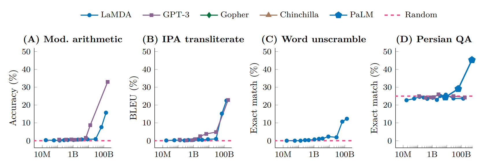
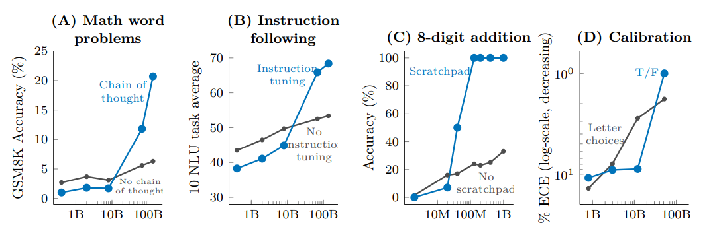
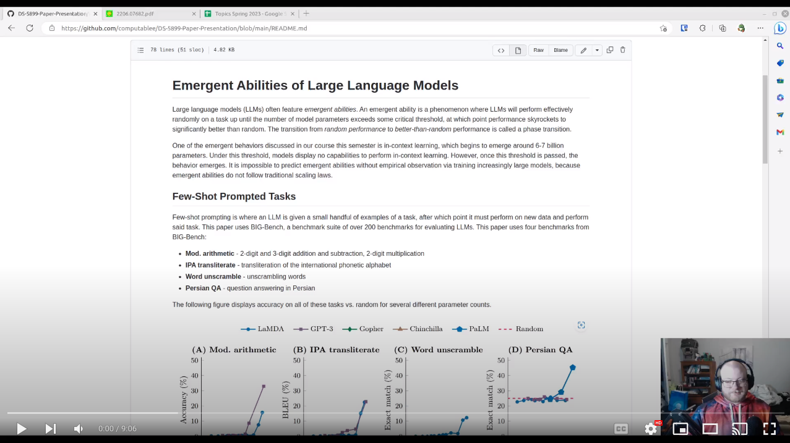

# Emergent Abilities of Large Language Models
Large language models (LLMs) often feature *emergent abilities*.
An emergent ability is a phenomenon where LLMs will perform effectively randomly on a task until the number of model parameters exceeds some critical threshold, at which point performance skyrockets to significantly better than random.
The transition from *random performance* to *better-than-random* performance is called a phase transition.

One of the emergent behaviors discussed in our course this semester is in-context learning, which begins to emerge around 6-7 billion parameters.
Under this threshold, models display no capabilities to perform in-context learning.
However, once this threshold is passed, the behavior emerges.
It is impossible to predict emergent abilities without empirical observation via training increasingly large models, because emergent abilities do not follow traditional scaling laws.

## Few-Shot Prompted Tasks

Few-shot prompting is where an LLM is given a small handful of examples of a task, after which point it must perform on new data and perform said task.
This paper uses BIG-Bench, a benchmark suite of over 200 benchmarks for evaluating LLMs. This paper uses four benchmarks from BIG-Bench:

* **Mod. arithmetic** - 2-digit and 3-digit addition and subtraction, 2-digit multiplication
* **IPA transliterate** - transliteration of the international phonetic alphabet
* **Word unscramble** - unscrambling words
* **Persian QA** - question answering in Persian

The following figure displays accuracy on all of these tasks vs. random for several different parameter counts.

GPT-3 begins to exceed random performance around 13B parameters, and LaMDA exceeds random performance around 68B parameters.

Since this paper has no code, nor is it possibly feasible to run any of these LLMs with billions of parameters in a Jupyter notebook,
I'll be sprinkling into this paper examples of emergent behavior in ChatGPT.
Here's an example of **Word unscramble** in ChatGPT, using few-shot prompted learning, indicating that ChatGPT is north of 13B parameters (duh!)

**Q1: What might be the reason that LaMDA requires so many more parameters than GPT-3 does to achieve the same emergent behavior?**

## Augmented Prompting Strategies

The authors consider another, different kind of emergent ability--efficacy of prompt engineering.
In essense, if a certain prompt does not aide or is harmful to achieving a goal below a certain parameter count, yet is beneficial above that parameter count, this is also an emergent ability.

The authors use four benchmarks to evaluate augmented prompting strategies:

* **Math word problems** - Solving word problems in mathematics with or without a prompt expressing a desire for a chain-of-thought
* **Instruction following** - Following instrucions with or without fine-tuning the model on instruction following
* **8-digit addition** - Computing the addition of two 8-digit numbers with or without a prompt expressing a desire for a scratchpad
* **Calibration** - Predicting what types of questions a model will be able to answer correctly using either multiple choice or true/false

The following figure displays accuracy on all of these tasks vs. random for several different parameter counts.

The model shown in A-C is LaMDA, and the model shown in D is a model by Anthropic.

For **Math word problems**, chain-of-thought reasoning starts to improve accuracy after a model exceeds 100B parmeters.
For **Instruction following**, instruction fine-tuning improves accuracy after a model exceeds 100B parameters.
For **8-digit addition**, a scratchpad improves accuracy after a model exceeds 40M parameters (million, not billion!).
For **Calibration**, true/false improves accuracy after a model exceeds 52B parameters.

Here's chain-of-thought used to help ChatGPT solve a high school math word problem.
First, I tell ChatGPT to *only* say the answer and to *not* show its work:

This answer is incorrect. However, when I ask it to show its work...

And I omit the long train of thought to save space (but trust me, it's there), ChatGPT is able to come up with...

Which is **correct!**

**Q2: Does this tell us that ChatGPT is at least 100B parameters?**

## Analysis
This paper does a great job of quantifying emergent behavior, but seemed lacking when discussing emergent risks.
For many of the emergent behaviors, nice graphs were shown that allowed easy visualization of the phenomena.
However, when discussing emergent risks, it was largely a quick summary sentence followed by a citation.
I would have preferred a more in-depth literature review of emergent risks, because these are very scary for the future of LLMs.

## Video
Attached is a video of me going over this repository.

## Links
Here's a few links I think may be beneficial.

* [Language Models are Few-Shot Learners](https://arxiv.org/abs/2005.14165), a paper which demonstrates that LLMs are great at task-agnostic, few-shot learning, comparable with even fine-tuned models.
* [The original paper for BIG-Bench](https://arxiv.org/abs/2206.04615), which outlines the BIG-Bench benchmark suite for LLMs.
* [BIG-Bench GitHub Repo](https://github.com/google/BIG-bench), which contains all of the benchmarks for your own testing!
* [Challenging BIG-Bench Tasks and Whether Chain-of-thought Can Solve Them](https://arxiv.org/abs/2210.09261), which demonstrates that chain-of-thought prompting can improve performance on BIG-Bench.
* [Language Models (Mostly) Know What They Know](https://arxiv.org/abs/2207.05221), a paper that demonstrated **Calibration**, which is a way of asking a language model what it knows (and they *usually* do).
